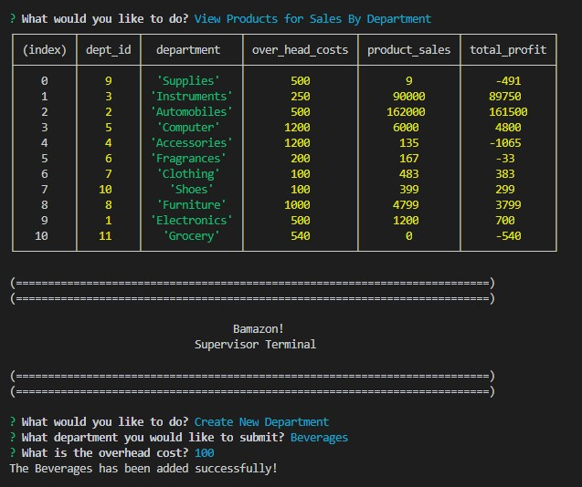

# Bamazon

## Bamazon is a customer Node JS CLI app that updates sales data and allows business managers/supervisors to update inventory and stock quantities. It gives you back data.

### Below are snapshots of how Bamazon works works!

### Bamazon will allow a customer to chose an item to purchase

#### * Price calculation
#### * Auto update inventory levels

### Bamazon Manager Terminal will allow a user to

#### * view inventory product data and sales

#### * update and adjust product quantities

### Bamazon will allow Supervisors to view:

#### * Add additional departments

#### * Meta-data dynamically created profit-column

